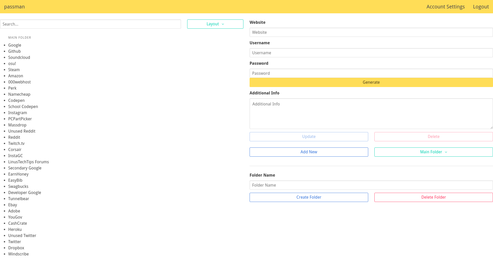
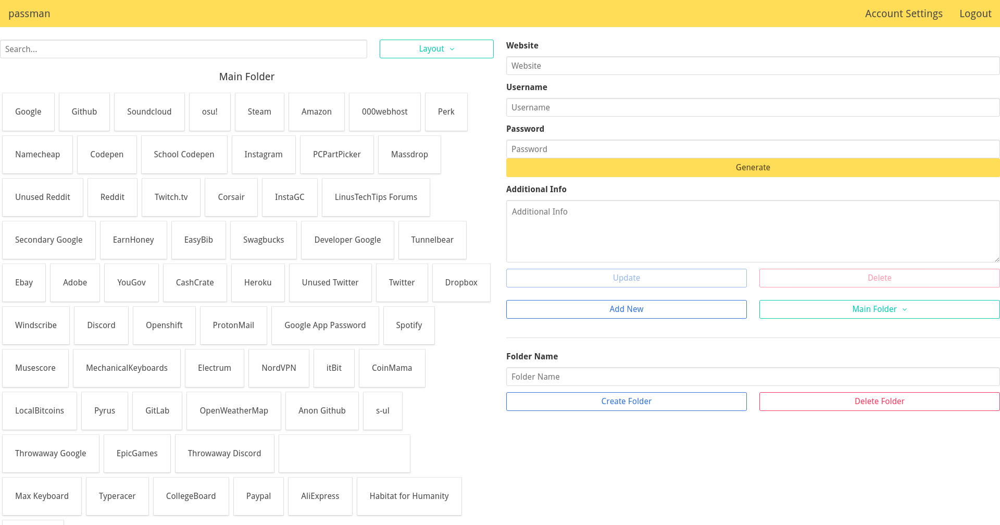

# password_manager

A password manager for the 21st century.  Built with Pug, Bulma, PouchDB, and Node for personal, everyday use.

## Features

- Responsive UI
- Two included layouts
- Folders
- Random secure rassword generator
- Rudimentary settings page

I have been using this almost daily for two years, that being said I can't necessarily advise that it be hosted publicly as, while I have done my best to ensure security, I'm not a cryptographer and have done this mainly for fun and learning.

While this app works well for the most basic of usecases (i.e. storing and retrieving passwords), it lacks much beyond this -- it remains in somewhat of an eternal WIP state as a result

## Screenshots






## Using

```
# setup
$ npm install
$ npm run build

# install pouchdb-server (globally)
$ npm install -g pouchdb-server
$ mkdir db

# start pouchdb, detach
$ pouchdb-server -d ./db &

# run app
$ node app.js
```

## Technical Explanation

When a new user is created:

 - PBKDF2 hashing:  Salt + user's password + time of creation

When a new website is added:

 - AES encryption:  The following is stored under the user's "passwords" array in the database
    - String:  Stringified JSON from the website form (includes website, username, password, and info)
    - Key:  User's hashed password + date of website creation + random salt
 - AJAX communication:
    - Client's request:
       - Website ID
       - Time of action taken (UNIX timestamp)
       - Action to take (delete, update, add)
          - If adding a new site, a 30-character, randomly-generated string must also be included, the 5th through 15th characters of which are used to encrypt the website's data using AES
             - This is only to allow for more secure transfer, this AES-encrypted string is not the one entered into the databse
